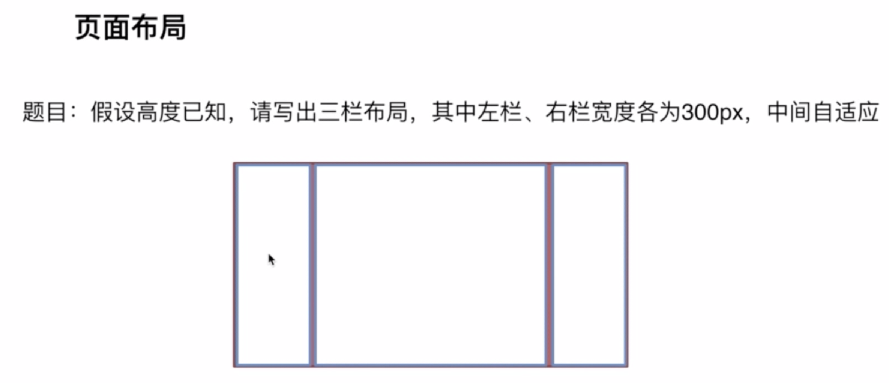

# 前端面试知识点系统梳理
## 相关
1. [幕布](https://mubu.com/doc/qWazGTCXz0)
2. [课程1](https://pan.baidu.com/disk/home?#/all?vmode=list&path=%2Fmooc%E7%BD%91%E6%95%99%E7%A8%8B2019%2F%E5%89%8D%E7%AB%AF%E8%B7%B3%E6%A7%BD%E9%9D%A2%E8%AF%95%E5%BF%85%E5%A4%87%E6%8A%80%E5%B7%A7)

## 页面布局
### 三栏布局
#### 两侧宽度固定, 中间自适应

> 目录layout_1
#### 答案
1. float + margin
2. position + margin
3. flex
4. table-cell
5. grid
6. 圣杯布局
7. 双飞翼布局
#### 拓展 TODO
1. 方案的优缺点
   1. 浮动方案
   2. 绝对定位
   3. flex兼容性有问题, 一般用在移动端, 两侧同时增高
   4. 表格布局优点, 兼容性好; 两侧同时增高
   5. grid布局新出的, css把模拟网格布局标准化; 缺点兼容性不好
2. 如果高度也自适应, 哪些方案可用
3. 业务中, 兼容性等, 选哪个方案

### 上下高度固定, 中间自适应 TODO
> 移动端常见

### 两栏布局
#### 左侧固定, 右侧自适应 TODO

#### 右侧固定, 左侧自适应 TODO

#### 上高度固定, 下自适应 TODO

#### 下高度固定, 上自适应 TODO
