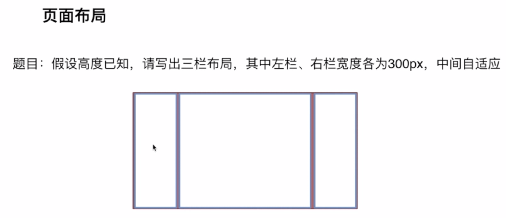

# 前端面试知识点系统梳理
## 相关
1. [幕布](https://mubu.com/doc/qWazGTCXz0)
2. [课程1](https://pan.baidu.com/disk/home?#/all?vmode=list&path=%2Fmooc%E7%BD%91%E6%95%99%E7%A8%8B2019%2F%E5%89%8D%E7%AB%AF%E8%B7%B3%E6%A7%BD%E9%9D%A2%E8%AF%95%E5%BF%85%E5%A4%87%E6%8A%80%E5%B7%A7)

## 页面布局
### 三栏布局
#### 两侧宽度固定, 中间自适应

> 目录layout
#### 答案
1. float + margin
2. position + margin
3. flex
4. table-cell
5. grid
6. 圣杯布局
7. 双飞翼布局
#### 拓展 TODO
1. 方案的优缺点
   1. 浮动方案
   2. 绝对定位
   3. flex兼容性有问题, 一般用在移动端, 两侧同时增高
   4. 表格布局优点, 兼容性好; 两侧同时增高
   5. grid布局新出的, css把模拟网格布局标准化; 缺点兼容性不好
2. 如果高度也自适应, 哪些方案可用
3. 业务中, 兼容性等, 选哪个方案

### 上下高度固定, 中间自适应 TODO
> 移动端常见

### 两栏布局
#### 左侧固定, 右侧自适应 TODO

#### 右侧固定, 左侧自适应 TODO

#### 上高度固定, 下自适应 TODO

#### 下高度固定, 上自适应 TODO

## CSS盒模型
### 基本概念


### 区别

### css如何设置

### js如何获取盒模型的宽和高
### 边距重叠
> [边距重叠与BFC](https://segmentfault.com/a/1190000012265930)
#### 父子元素的边界重叠
```css
<style>
    .parent {
        background: #E7A1C5;
    }
    .parent .child {
        background: #C8CDF5;
        height: 100px;
        margin-top: 10px;
    }
</style>
<section class="parent">
    <article class="child"></article>
</section>

```
#### 兄弟元素的边界重叠
```css
<style>
    #margin {
        background: #E7A1C5;
        overflow: hidden;
        width: 300px;
    }
    #margin>p {
        background: #C8CDF5;
        margin: 20px auto 30px;
    }
</style>
<section id="margin">
    <p>1</p>
    <p>2</p>
    <p>3</p>
</section>

```
### BFC/IFC
#### BFC概念
> BFC的全称为Block Formatting Context，即块级格式化上下文。
#### BFC特点
1. 处于同一个BFC中的元素相互影响，可能会发生margin collapse
2. BFC在页面上是一个独立的容器，容器里面的子元素不会影响到外面的元素，反之亦然
3. 计算BFC的高度时，考虑BFC所包含的所有元素，包括浮动元素也参与计算
4. 浮动盒的区域不会叠加到BFC上

#### 创建BFC
1. 浮动（float的值不为none)
2. 绝对定位元素（position的值为absolute或fixed)
3. 行内块（display为inline-block）
4. 表格单元（display为table、table-cell、table-caption等HTML表格相关属性)
5. 弹性盒（display为flex或inline-flex)
6. overflow不为visible
